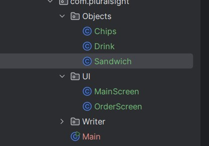
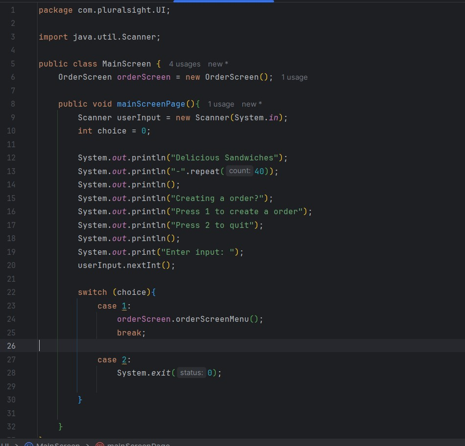
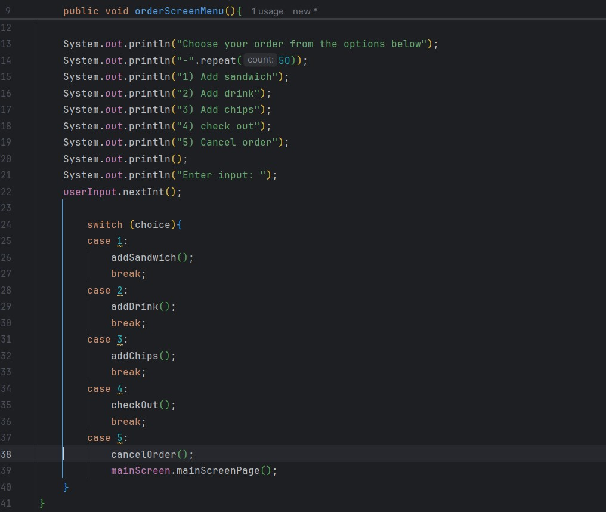

# DeliKioskapp

This application is a point of sales application for a sandwich shop. It allows a user to order a sandwich with diffrient toppings and size of sandwich. Besides that, it can add also a drink along with chips and will write a reciept once you checkout with your order.

5-24-24

Started off white boarding the main parts of the project and figuring out what I needed and to start on first. 
Picture of the white board below.

I started off eventually with making the classes I would need and folders to organize them.
Picture of the organization below.

 I then started making the screens 1st to make sure I had a way of testing sections were working as I kept going with the project.
 Pictures of the MainScreen (first screenshot) and OrderScreen (Second Picture) below.
 
 

 bugs or errors: N/A